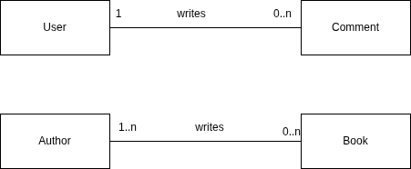
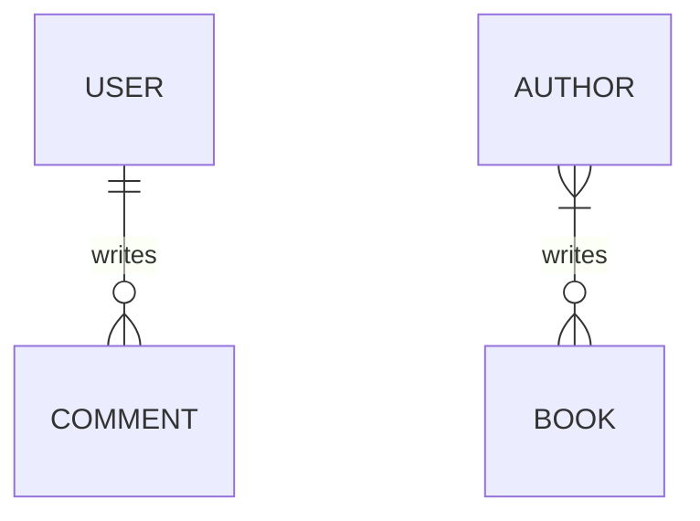

# Database for non-developers

## Structured data

Everything you know can be data, but some are easier to work with. Consider this
address:

```plain
285 Cach Mang Thang Tam Street, Hoa Hung Ward, Ho Chi Minh City, Viet Nam
```

and this:

```plain
Building number: 285
Street: Cach Mang Thang Tam
Ward: Hoa Hung
City: Ho Chi Minh City
Country: Viet Nam
```

Both convey the same information, but one is trivial to see the structure while
the other doesn't. The plain address is **unstructured data** while the one with
each component listed on a line is called **structured data**.

!!! note

    The colon is not the requirement of structured data. The fact that the address
    is broken into named parts is. We can write it like this:

    ```plain
    The address building number is 285
    The address street is Cach Mang Thang Tam
    The address ward is Hoa Hung
    The address city is Ho Chi Minh City
    The address country is Viet Nam
    ```

    Writing this way does not make use of any special character like the colon, but
    it can still highlight the fact that an address have building number, street,
    ward, city and country. That's the "structured" part.

Unstructured data can be transformed into structured data by parsing them using
some defined **data schema** (description of the structure of the data). For
example: for the address above, the schema is something like "an address
contains a building number, street, ward, city and country". The idea of schema
is just that, but when we work with computer systems, we usually have dedicated
computer languages to describe the schema instead of plain English.

The process of parsing into structured data is error-prone because unstructured
data can be anything. Consider these data:

```plain
1234 ABC St.
12/3/4 cmt8 street HCMC
It's Vietnam: "285 đường Cách mạng tháng Tám, Phường 12, Quận 10, Hồ Chí Minh"
```

- The first address only have building number and the street name, but the word
    "street" is abbreviated so the street name is ABC.
- The second address has two slashes for alleys. Depending on how we design our
    schema, it may not be able to store this kind of address because of the
    alley subdivision. Besides, it also uses abbreviations heavily and does not
    include ward and country
- The third one contains noise, not just the address but also words from the
    conversation which we don't care about if we want an address. It is also
    written in another language and use inconsistent case, some words are
    capitalized while the other don't. Moreover, the address follows the old
    Vietnamese address system which still have district ("quận"). This last one
    is tricky because it involves domain knowledge about your data: the fact
    that Vietnamese eliminated district from the address system to merge into
    larger wards. This shows that working with the data is not just technical
    problem.

Just 3 examples and we can see lots of things can go wrong when converting
unstructured data into structured data. Most notable is the fact that **we
cannot represent the third example using our schema at all**, because our schema
does not mention district.

!!! tip

    This is an important point to keep in mind: the data schema is our best effort
    design to capture what we observed about the data, it is not guaranteed to be
    true, you can only know if is good or not by considering the actual data.

Reliably converting unstructured data into structured data is extremely hard and
is not the focus of this article. Here we will work with structured data only.

!!! tip

    Because of that complexity, we should aim at making the data structured in the
    first place if possible. For example, if you want to ask the user a yes/no
    question, you should use a two-choice form field (for example: radio button,
    2-state checkbox) instead of a text field. The user can't enter other value
    using the radio button or checkbox, but they can type in some gibberish like
    "dunno" when we expect only "yes" and "no".

## Relational database

**Database management systems** (DBMS) store structured data and make use of the
knowledge about the structure to make operations efficient. The dominant type of
DBMS is **relational database management system** (RDBMS) and the language to
work with them is called **SQL** (short for **Structured Query Language**, you
can spell each letter, or pronounce this as "sequel").

People usually call DBMS by just "database" for short. Relational database is
the oldest kind of database that are still popular. The most common
implementation is PostgreSQL.

!!! info

    The relational database is just a concept. Their implementations are what we
    actually use. Think of the "database" concept as the concept of "car". It's
    abstract. We don't drive the "car" concept, we drive a specific car. You may
    drive an electric car, other people may drive petrol-powered car. How the car
    engine runs is different wildly between them, but they both serve the same
    purpose: carrying passengers moving faster with less effort.

## SQL

Relational databases store data in **tables**. Each table contains **columns**
to capture an aspect about the record. Each **row** is a data record.

!!! warning

    SQL is a standard, so ideally we should only need to learn once and can use any
    implementation, be it PostgreSQL or SQL Server. Unfortunately, implementations
    don't fully conform to SQL, so your queries running perfectly on this system may
    not work at all when copying to another system (from PostgreSQL to SQL Server
    for example). This article focuses on PostgreSQL only.

TODO: Guide to Setting up PostgreSQL locally. Or guide to creating new database
on Supabase

To create a new table using SQL, you use the `CREATE TABLE` statement:

```sql
create table <your table name here>(
  <your column definitions go here>
);
```

!!! note

    SQL is case-insensitive, so `create table` is the same as `CREATE TABLE`

Because SQL is a computer language, it follows naming convention in programming
world. The naming convention for database is called `snake_case`: words are
written in lowercase and contain only alphanumerics, spaces are replaced with
underscores. By convention, we use plural form for table name because a table
will contain many records. So, if you want a database table to store points of
interest, you would name it `points_of_interest`.

!!! info

    In PostgreSQL, you can use anything as table name, including normal English like
    `"Points of Interest"`. The `snake_case` convention is not a PostgreSQL
    limitation, it is the limitation of the ecosystem around it.

    This is also an example of PostgreSQL feature richness.

A table must have columns. The simplest form of column definition is
`<column name> <data type>`. To define columns we need to learn about another
thing: data type.

### Data types

In SQL, columns have types to let the database system know what can be done on
these values. Different types have different operations available. For example:
adding two numbers together is reasonable, but it doesn't make sense adding
today and yesterday.

There are many similar types in PostgreSQL with different sizes to serve
engineering need. We will ignore most them and only choose one representative
type for each category:

- `boolean`: `true` or `false`
- `integer`: whole numbers (`-1`, `0`, `1`, `999999`, etc.)
- `numeric`: decimal number, e.g: `0.1`, `-12.34`, `987654321.0123456`, etc.
- `varchar` (short for `varying character`): arbitrary text (called "string" in
    programming), wrapped inside single quote. Example: `'this is a string'`
- `date`: date without time, written in ISO format (`YYYY-mm-dd`) and are
    wrapped inside a pair of single quote. Example: `'2025-01-01'`. This is
    rarely useful though, `timestamptz` is better for most use cases.
- `timestamptz` (short for `timestamp with time zone`): confusingly, this is not
    stored as time with time zone, but as elapsed time since Unix epoch, so if
    you really want to preserve the input, you need another column to store the
    time zone. It is wrapped in double quote. Example:
    `'2020-01-01T00:00:01+07:00'`

!!! info

    Epoch is a reference point, i.e: a special moment in the timeline being chosen
    to use as the origin to calculate the rest. Any other moment can be represented
    as time elapsed since epoch. For example, if you chose `2000-01-01 00:00:00` as
    epoch, then the timestamp `2000-01-01 00:01:00` is "60 seconds since epoch" and
    the computer just need to store the number `60`. The epoch used by computer
    systems is called Unix epoch, which begins at 1970-01-01 00:00:00 UTC.

There is another number type called `float`. It is *inexact* real numbers.
Ideally we should never need to use it, prefer `numeric` instead.

Note that the number `123` can be stored as `integer` or as `varchar`, but if it
is stored as `varchar`, the system won't know that it is a number and will
prevent you from adding it to another number. Therefore, getting the type
correct is important.

This is the bare minimum that we need to create a column.

Now, let's take the address example at the beginning as the modeling target. To
create a table for that, we can use this SQL query:

```sql
create table addresses(
  building_number varchar,
  street varchar,
  ward varchar,
  city varchar,
  country varchar
);
```

!!! note

    Notice the `building_number` column above? Although the name contains the word
    "number", it is typed as `varchar`. This is to support buildings in alleys which
    contains the forward slash (`/`). The colunmn name is not correctly express our
    usage intention. We will see this imperfection in practice a lot. Next time you
    read a schema, make sure to verify the intended use case of them, don't just
    guess from the name.

### Constraints

Apart from data type, relational databases also have other constraints to allow
you to describe your data better.

First is the `NOT NULL` constraint. In SQL, by default your column can contain a
special value called `NULL` to represent missing value. If your exam `score` is
`0`, you have an exam, but if your exam score is `null`, it means you don't have
an exam, or in other words: the `score` is missing/not present. If you want to
make sure a column always contain value, you can add the `NOT NULL` constraint
and the database will reject updates if the update can make the column `null`.

Constraints are added after data type, like this:

```sql
create table t(
  name varchar not null
);
```

Next, we have the `UNIQUE` constraint. It ensures each value in this column can
only appear at most once at a time. Let's say you have a phone number associated
to a social network account. The phone number can be unlinked from an account
and being linked to another account. However, it can't link to two accounts at
the same time. You can use `UNIQUE` constraint to ensure this.

Adding multiple constraints is simple, just list them out in any order you like:

```sql
create table t(
  column_a varchar not null unique, -- this is correct
  column_b varchar unique not null -- this is correct too
);
```

For easier reading, you should stick to a specific order though.

`UNIQUE` can be used on multiple columns. In that case it ensures there will be
no two row with matching data on all the columns listed. For example:

```sql
create table t(
  a integer,
  b integer,
  c integer
  unique(a, b)
);
```

You can insert `a = 1 b = 1` only once, trying to add another row with `a = 1`
and `b = 1` will fail, but you can add another row with `a = 1 b = 2`. As long
as not all columns are the same, it won't be blocked.

Sometimes the data type is not descriptive enough for your data. In these cases,
you can use `CHECK` constraint to further refine it. `CHECK` is defined with an
expression, if the result is true then the update is accepted, but if it is
false, it is rejected.

!!! note

    If you think this `CHECK` constraint can be used to check for `NOT NULL`, you
    are correct. The reason we have `NOT NULL` is similar to data type being
    separated from other constraints: the database can make good use of that
    information so they separate that out. This is a common theme in design, we will
    see this a lot in the future.

Example: to ensure `age` is positive we can write this:

```sql
create table t(
  age integer check (age > 0)
);
```

In practice, we rarely use this constraint because the application will validate
the data, not the database.

### Primary key and foreign key

Primary key is a column (or multiple columns) that can be used to uniquely
identify a row. In SQL, we use `PRIMARY KEY` constraint to define this.
`PRIMARY KEY` implies `NOT NULL` and `UNIQUE`.

```sql
create table t1(id integer primary key); 

-- same as above, but other constraints are redundant 
create table t2(id integer primary key not null unique);
```

!!! tip

    **Good key should be immutable (can't be changed).**

Tables can be related to each other. To represent the relationship between
tables, we repeat the primary key of a table in the other one. These repeated
columns are called **foreign key**. By adding that
`REFERENCES <table>(<primary_key_column>)` clause, the database will know this
is a foreign key. The database will make sure foreign key value matches the
referenced primary key.

Example:

```sql
create table people(
  id integer primary key,
  name varchar not null 
);
create table driving_licenses(
  id integer primary key,
  person_id integer references people(id)
);
```

In this example, if `person_id` in `driving_licenses` contains the value `5`,
then there must be a row in the table `people` whose `id` is `5`. The database
ensures this.

Changing primary key value is hard because we also need to update foreign key
value, so usually we will create a column whose value is completely unrelated to
our data to use as primary key. This is called **synthetic key**. Using
synthetic key as primary key is extremely common because it makes the code much
easier to write.

If your primary key consists of multiple columns (in this case the key is called
**composite key**), you can write the constraint on a separate line. Because the
`PRIMARY KEY` constraint is not on a single column anymore, you need to make
sure involved columns are `NOT NULL`.

```sql
create table salaries(
  organisation_id integer not null,
  person_id integer not null,
  salary integer not null,
  primary key(organisation_id, person_id) 
);
```

The foreign key in this case will be multiple columns too:

```sql
create table salaries(
  organisation_id integer not null,
  person_id integer not null,
  salary integer not null,
  primary key(organisation_id, person_id) 
);

create table t(
  organisation_id integer not null,
  person_id integer not null,
  some_data varchar,
  foreign key(organisation_id, person_id) references salaries(organisation_id, person_id)
);
```

!!! info

    This shows why synthetic key is better in practice. You don't need to add
    multiple columns to use as foreign key.

## Modeling your data

The most important thing to keep in mind when designing data model is **making
sure data is correct**. Incorrect data is useless.

We will try to **avoid duplication** because when data is duplicated, we may end
up changing one of the record and miss the other, making them inconsistent and
affect data correctness.

To design your database, we start with identifying **entities** (things) and
their **relationships**. Entities have **attributes**. Whether a piece of data
is entity or attribute depends mostly on our point of view. For example: an
address can be an entity if we care about its structure, or if we only store it
for display, it can be attribute of another entity.

These information can be captured into a kind of diagram called
**Entity-Relationship Diagram (ERD)**.

!!! warning

    ERD is hard to read, so it is mostly useless in practice. Draw anything you want
    to as long as you can express your entities and relationships.

Relationship is about the number of related records. We only care about zero,
one, or many. Some example of relationships:

- A user can write many comments, but a comment is written by only one user.
    This user-comment relationship is **one-to-many**.
- Reversing the direction, we will get **many-to-one**: A comment can be written
    by a user, but a user can write many comments. This comment-user
    relationship is **many-to-one**.
- Author can write multiple books. A book can be written by multiple authors.
    This relationship is a **many-to-many** relationship.

In diagrams, people usually write `0..1` to express that a side of relationship
allows zero, `0..n` or `*` to signal that the annotated side allows zero. The
example above can be drawn as diagram like this (not ERD):



This reads as:

- A user writes 0 or many comments.
- A comment is written by 1 user.
- An author writes 0 or many books.
- A book is written by 1 or many authors.

The ERD equivalent is:



You can see that ERD is full of strange symbols, it is not clearer. This is why
I said it is mostly useless in practice.

## Modeling example

TODO: Write this

## Database modeling patterns

### Soft delete

Sometimes we want to keep the data in the database when users request for
deletion. This can be implemented using an extra column to track soft-deleted
timestamp, like this:

```sql
create table t(
    id integer primary key,
    data varchar,
    deleted_at timestamptz
```

### Polymorphic association

When a relationship can refer to different tables, we can add another column to
tell what table are being referenced.

This bypasses the foreign key feature of the database, so we should avoid this
if possible.

<!-- versioned, bitemporal, multi-tenant, lookup table -->
