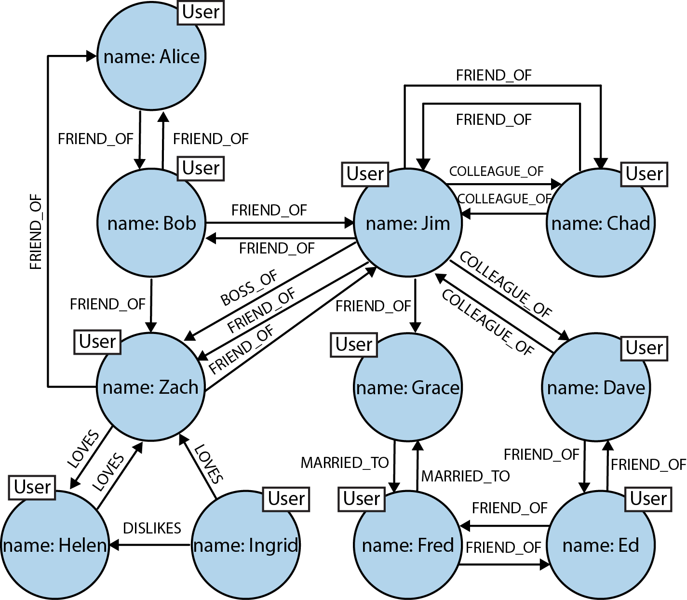
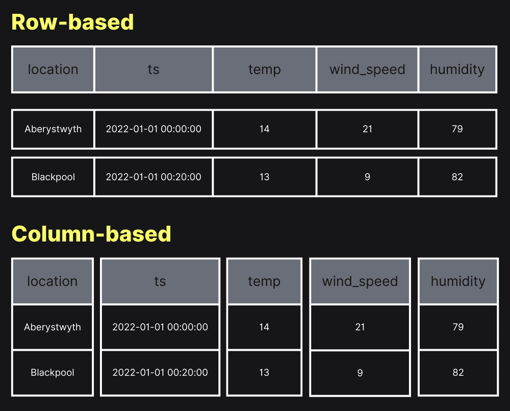

# Introduction to database

## Structured data

Everything you know can be data, but some are easier to work with. Consider this
address:

```plain
285 Cach Mang Thang Tam Street, Hoa Hung Ward, Ho Chi Minh City, Viet Nam
```

and this:

```plain
Building number: 285
Street: Cach Mang Thang Tam
Ward: Hoa Hung
City: Ho Chi Minh City
Country: Viet Nam
```

Both convey the same information, but one is trivial to see the structure while
the other doesn't. The plain address is **unstructured data** while the one with
each component listed on a line is called **structured data**.

!!! note

    The colon is not the requirement of structured data. The fact that the address
    is broken into named parts is. We can write it like this:

    ```plain
    The address building number is 285
    The address street is Cach Mang Thang Tam
    The address ward is Hoa Hung
    The address city is Ho Chi Minh City
    The address country is Viet Nam
    ```

    Writing this way does not make use of any special character like the colon, but
    it can still highlight the fact that an address have building number, street,
    ward, city and country. That's the "structured" part.

Unstructured data can be transformed into structured data by parsing them using
some defined **data schema** (description of the structure of the data). For
example: for the address above, the schema is something like "an address
contains a building number, street, ward, city and country". The idea of schema
is just that, but when we work with computer systems, we usually have dedicated
computer languages to describe the schema instead of plain English.

The process of parsing into structured data is error-prone because unstructured
data can be anything. Consider these data:

```plain
1234 ABC St.
12/3/4 cmt8 street HCMC
It's Vietnam: "285 đường Cách mạng tháng Tám, Phường 12, Quận 10, Hồ Chí Minh"
```

- The first address only have building number and the street name, but the word
    "street" is abbreviated so the street name is ABC.
- The second address has two slashes for alleys. Depending on how we design our
    schema, it may not be able to store this kind of address because of the
    alley subdivision. Besides, it also uses abbreviations heavily and does not
    include ward and country
- The third one contains noise, not just the address but also words from the
    conversation which we don't care about if we want an address. It is also
    written in another language and use inconsistent case, some words are
    capitalized while the other don't. Moreover, the address follows the old
    Vietnamese address system which still have district ("quận"). This last one
    is tricky because it involves domain knowledge about your data: the fact
    that Vietnamese eliminated district from the address system to merge into
    larger wards. This shows that working with the data is not just technical
    problem.

Just 3 examples and we can see lots of things can go wrong when converting
unstructured data into structured data. Most notable is the fact that **we
cannot represent the third example using our schema at all**, because our schema
does not mention district.

!!! tip

    This is an important point to keep in mind: the data schema is our best effort
    design to capture what we observed about the data, it is not guaranteed to be
    true, you can only know if is good or not by considering the actual data.

Reliably converting unstructured data into structured data is extremely hard and
is not the focus of this article. Here we will work with structured data only.

!!! tip

    Because of that complexity, we should aim at making the data structured in the
    first place if possible. For example, if you want to ask the user a yes/no
    question, you should use a two-choice form field (for example: radio button,
    2-state checkbox) instead of a text field. The user can't enter other value
    using the radio button or checkbox, but they can type in some gibberish like
    "dunno" when we expect only "yes" and "no".

### Recap

- Unstructured data is easy to store but hard to process because we know nothing
    about it.
- Structured data is data with structure. The structure tells us something about
    the data, so it's easier to work with.
- Structured data has a data schema to describe its structure
- Converting unstructured data to structured data is hard, and our data schema
    is best-effort documentation of the data structure only, cannot represent
    every piece of data out there.
- Converting to structured data is hard, so it's better to make the data
    structured from the beginning if possible

## Database management system

**Database management system** (DBMS) is system to manage and extract value from
the data stored efficiently. To achieve that, we can't just throw data into the
system randomly and hope it works, proper data design is needed. That's where
structured data is needed. Structured data provide extra information to the
system to make it work effectively with the data.

The dominant type of DBMS is **relational database management system** (RDBMS)
and the language to work with them is called **SQL** (short for **Structured
Query Language**, you can spell each letter, or pronounce this as "sequel"). The
"relational" part is probably come **relational algebra**, but this branch of
mathematics is not that important in practical system.

To keep it simple, people usually call DBMS by just "database" for short.
Relational database is the oldest kind of database that are still popular.
Common implementations are PostgreSQL, MySQL, MariaDB (an open source and
mostly-compatible with MySQL implementation) and SQL Server (Microsoft stuff,
quite costly to use in production).

!!! info

    The relational database is just an idea. Their implementations are what we
    actually use. Think of the "database" concept as the concept of "car". It's
    abstract. We don't drive the "car" concept, we drive a specific car. You may
    drive an electric car, other people may drive petrol-powered car. How the car
    engine run is different wildly between them, but they both serve the same
    purpose and can carry the same number of passengers. "The thing that can carry a
    small number of passengers to move a long distance" is the **abstract idea**,
    electric car and petrol-powered car are **different implementations of the same
    idea**.

Around 2010, other kinds of DBMS appears and are later collectively called
**NoSQL**. It is said to mean "No SQL", but some says it's "Not Only SQL".
Doesn't matter. Just keep in mind they are designed to address very specific
problems with RDBMS at large scale in trade of several other disadvantages, so
it should never be your first choice.

!!! tip

    If you don't know what database to use, pick a relational database, specifically
    PostgreSQL. NoSQL databases are designed for very narrow use case, so it should
    only be used when the requirement is clear.

### Recap

- Database systems work with structured data
- Relational database uses SQL as the language to work with
- Relational database is the oldest one still popular in production. Most
    popular implementation is PostgreSQL
- NoSQL optimizes for speed at large scale by accepting other severe trade-offs.
    PostgreSQL should be the default choice for every new project.

## Types of database

!!! warning

    This section is long because it introduces lots of database systems. If you
    don't care about them, read the subsection about relational database then jump
    directly into the next section.

### Key-value database

The data is stored as a collection of key-value pair. Value can be anything, the
database only care about the key. One key is associated to one value, value can
be the same, but key must be unique.

This kind of database does not require a data schema explicitly defined. The
most common implementation is Redis.

Example:

```plain
bear: to accept, tolerate, or endure something, especially something unpleasant
```

This is an excerpt from
[Cambridge dictionary](https://dictionary.cambridge.org/dictionary/english/bear).
This dictionary is an example of key-value database: the key is the word (`bear`
in this example), the value is the meaning of the word. You don't have two
different entries in the dictionary for the same word (unique key), but you can
have 2 different words with the same meaning (different keys same value).

Pros:

- Key lookup is extremely fast. You don't need to read the whole dictionary to
    find the meaning (value) of a word (key).
- Simple to understand

Cons:

- Limited query capability. All you can do is get value using key. If you want
    to filter using something in the value, you are out of luck.

### Document database

A document database is a collection of documents. Each document is an object
containing key-value pairs, but the value can be another object, so it allows
nesting. Each object must have a key.

This is the same as key-value database, but the value structure is known, so it
has more query power. This kind of database does not require a schema too.
Notable implementations are MongoDB and AWS DynamoDB.

Example:

```plain
{
  "_id": "12345",
  "name": "John Doe",
  "email": "john@example.com",
  "address": {
    "street": "123 Main St",
    "city": "Anytown",
    "zip": "12345"
  },
  "preferences": {
    "theme": "dark",
    "notifications": true
  }
}
```

The example above is written in JSON, but you don't need to know JSON syntax to
recognize what it means. You can easily guess that the record is about a user.
Their name is `John Doe`, their `_id` is `12345`, etc. The address is described
as a nested object with multiple fields to capture the address in a structured
way. In MongoDB, the `_id` is unique (there can't be 2 different objects with
the same `_id`).

Here you can see that the related key-value pairs are grouped into a single
object, and the value can be another object with arbitrary depth (it can be an
object containing an object containing another object ad infinitum). This
enables more advanced queries, for example: find all customers with the `name`
of `ABC` and use `gmail.com`. Because the `name` and `email` belongs to the same
document, and a document represents a customer, the query above makes sense. It
returns the list of customers matching the query condition.

Pros:

- More powerful query capability

Cons:

- Shared objects are either repeated for each document or have to be joined
    manually by querying from multiple collections and match the keys manually.

### Graph database

Unlike the previous two, this one stores data in a structure called graph. This
is not the graph of a function like in math, but a structure of nodes for
entities and edges for relationships. Look at this example:

<figure markdown="span">



<figcaption markdown="span">
Graph example<br>
Source: [Graph Databases, 2nd Edition](https://www.oreilly.com/library/view/graph-databases-2nd/9781491930885/)
</figcaption>
</figure>

We can see that the people (entities) are modeled as nodes and are connected by
edges showing relationships among people. This kind of representation is
extremely powerful. However, this comes with huge complexity and is hard to run
efficiently at large scale so in practice we rarely see this kind of database.

!!! info

    Remember the unstructured vs structured data in the first chapter? Graph
    database is in a similar theme. The more flexibility, the higher cost you have
    to pay. Unstructured data is the most flexible, it is data without any
    restriction. And no restriction means our database system knows nothing about
    the data so it doesn't know how to do any useful thing with it. When we add a
    schema to make it structured, we are adding a restriction and make it less
    flexible. In trade we now have the ability to query the data efficiently.

Pros:

- Powerful representation, flexible enough to represent almost everything

Cons:

- Extreme flexibility makes it hard to implement efficiently

### Relational database

This is the central database type of this article.

Relational database is the oldest one while still being the dominant choice in
production due to its proven stability throughout decades of powering world's
largest systems. At the time of writing, the most popular relational database is
PostgreSQL.

!!! info

    Note: This part is safe to skip.

    PostgreSQL is popular today mainly due to these reasons:

    - Rich ecosystem: PostgreSQL development is still going strong, with new
        features keep coming in and existing feature being improved release after
        release. For the missing features,
        [there are extensions to fill the gap](https://www.tigerdata.com/blog/its-2026-just-use-postgres).
        The system is designed to be extensible, so people can build things on top
        of the base PostgreSQL to add the features they need.

    - Huge community and userbase:

        PostgreSQL is used by:

        - [OpenAI, the company behind ChatGPT](https://openai.com/index/scaling-postgresql/)
        - [Instagram](https://instagram-engineering.com/under-the-hood-instagram-in-2015-8e8aff5ab7c2)
        - [Reddit](https://github.com/reddit-archive/reddit/wiki/Architecture-Overview)
        - [Spotify](https://engineering.atspotify.com/2013/03/backend-infrastructure-at-spotify)
        - [Twitch](https://blog.twitch.tv/en/2016/10/11/how-twitch-uses-postgresql-c34aa9e56f58/)
        - ... and a lot more

        [Many products are built on top of PostgreSQL](https://wiki.postgresql.org/wiki/PostgreSQL_derived_databases),
        lots of learning resources about PostgreSQL has been written.

    - Truly open source: Popular relational databases are MySQL, PostgreSQL, Oracle
        Database, SQL Server. MySQL is also open source like PostgreSQL but is under
        control of Oracle. Oracle is the company that bought the Java programming
        language -- the language that used to power every Android system. However,
        that company is famous not for their technical product, but for lawsuits
        against other companies, most notably
        [the one against Google](https://en.wikipedia.org/wiki/Google_LLC_v._Oracle_America,_Inc.)
        (and probably the whole world). The database is a critical piece of
        infrastructure so people are reluctant to depend on something controlled by
        such company. SQL Server is from Microsoft, Oracle database is also from
        Oracle, they are not open source, and they cost a lot of money to buy the
        license for production use. PostgreSQL is too good while being completely
        free (both meaning of free: "free" in "free beer" and free in "free
        speech"), so it is now the default choice whenever people think of
        relational database.

A relational database organizes data into **tables**, the schema is represented
as **table columns**, each data record is a **table row**. Because of relational
algebra, sometimes people uses weird terms for these simple things though: a
table is sometimes called a **relation**, a column is called **attribute**, and
a row is called **tuple**.

Unlike NoSQL databases presented before, relational database requires the user
to define the schema up front. This is what makes it so powerful.

### Columnar database

This is similar to relational database in a way: they store data in tables.
However, relational database table is row-based, while columnar database table
is column-based.

<figure markdown="span">


<figcaption markdown="span">
Row-based table vs column-based table<br>
Source: [ClickHouse Blog](https://clickhouse.com/resources/engineering/what-is-columnar-database)
</figcaption>
</figure>

For row-based design, you split the table into smaller partitions, each stores
some rows. For column-based design, you can store each column separately. They
are not required to be on the same device.

This design sounds weird, but it is useful in practice because usually your
column contain only a few unique values. Think of `year_of_birth` column, it is
unlikely to have more than 1000 different values. It would be impressive to have
a software serving people from 500 years ago or 500 years in the future. Based
on that fact, columnar database can compress the column to avoid having to store
the same value multiple times.

Besides, your query may not need all the data in a record. With the column-based
design, you only need to read from the columns involved. That's cheaper than
reading everything and discard the unneeded parts.

The downside is changes are harder to make. If you want to delete, you need to
go through each column to delete the data, ditto for insert and update. With
row-based design, it is extremely simple: find the row, drop it, done.

Pros:

- Good performance for read-only use

Cons:

- Poor performance when data change is frequent

### Recap

TODO: Example of the same piece of data being represented under different
database

## OLTP and OLAP

You may sometimes here people talking about **OLTP** (online transaction
processing) and **OLAP** (online analytical processing). That topic is deep, but
all you need to know are just two examples: money transfer and spending report.

It would be very bad when you received the money but can't use it because the
system still see your old balance and think you don't have money to spend.

Meanwhile, if some new records are missing from this month report, we can just
include it in the next month report. The processing of data is not that urgent.

These two examples should be enough to show you what's OLTP and OLAP:

- The money transfer example needs OLTP system because the processing must
    respond quickly, and it touches only small piece of data: your current
    balance and the latest transaction.
- The spending report benefits from OLAP more because the processing can
    tolerate a little bit outdated data, and it touches a huge amount of data:
    all transactions within a month.

!!! tip

    OLTP works with up-to-date data, OLAP can tolerate somewhat-outdated data.

    `T` for **transaction** (think money transfer). `A` for **analytic** (think
    spending report).

OLAP and OLTP are not mutually exclusive. In fact, they are usually used
together. In the example above, the OLTP system can be used to process user
transactions, then at the end of each day, the database can be copied into an
OLAP system for analyzing and reporting purpose. This allows complex analysis on
large amount of data without leaving the users waiting for a long time.

OLAP system is designed differently to optimize for its read-heavy nature, we
don't dig deeper into that. We will only explore OLTP because that's what we
will see and work with every day.

## SQL for creating tables

Quick reminder before we begin: relational database stores data in **table**,
with **columns** defining the data schema, each record is a **row**.

### Setup

!!! warning

    SQL is a standard, so ideally we should only need to learn once and can use any
    implementation, be it PostgreSQL or SQL Server. Unfortunately, implementations
    don't fully conform to SQL, so your queries running perfectly on this system may
    not work at all when copying to another system (from PostgreSQL to SQL Server
    for example). This article focuses on PostgreSQL only.

TODO: Guide to Setting up PostgreSQL locally. Or guide to creating new database
on Supabase

### Creating tables

To create a new table using SQL, you use the `CREATE TABLE` statement:

```sql
create table <your table name here>(
  <your column definitions go here>
);
```

!!! note

    SQL is case-insensitive, so `create table` is the same as `CREATE TABLE`

Because SQL is a computer language, it follows naming convention in programming
world. The naming convention for database is called `snake_case`: words are
written in lowercase and contain only alphanumerics, spaces are replaced with
underscores. By convention, we use plural form for table name because a table
will contain many records. So, if you want a database table to store points of
interest, you would name it `points_of_interest`.

!!! info

    In PostgreSQL, you can use anything as table name, including normal English like
    `"Points of Interest"`. The `snake_case` convention is not a PostgreSQL
    limitation, it is the limitation of the ecosystem around it.

    This is also an example of PostgreSQL feature richness.

A table must have columns. The simplest form of column definition is
`<column name> <data type>`. To define columns we need to learn about another
thing: data type.

### Data types

In SQL, columns have types to let the database system know what can be done on
these values. Different types have different operations available. For example:
adding two numbers together is reasonable, but it doesn't make sense adding
today and yesterday.

There are many similar types in PostgreSQL with different sizes to serve
engineering need. We will ignore most them and only choose one representative
type for each category:

- `boolean`: `true` or `false`
- `integer`: whole numbers (`-1`, `0`, `1`, `999999`, etc.)
- `numeric`: decimal number, e.g: `0.1`, `-12.34`, `987654321.0123456`, etc.
- `varchar` (short for `varying character`): arbitrary text (called "string" in
    programming), wrapped inside single quote. Example: `'this is a string'`
- `date`: date without time, written in ISO format (`YYYY-mm-dd`) and are
    wrapped inside a pair of single quote. Example: `'2025-01-01'`. This is
    rarely useful though, `timestamptz` is better for most use cases.
- `timestamptz` (short for `timestamp with time zone`): confusingly, this is not
    stored as time with time zone, but as elapsed time since epoch, so if you
    really want to preserve the input, you need another column to store the time
    zone. It is wrapped in double quote. Example: `2020-01-01T00:00:01+07:00`

!!! info

    Epoch is a reference point, i.e: a special moment in the timeline being chosen
    to use as the origin to calculate the rest. Any other moment can be represented
    as time elapsed since epoch. For example, if you chose `2000-01-01 00:00:00` as
    epoch, then the timestamp `2000-01-01 00:01:00` is "60 seconds since epoch" and
    the computer just need to store the number `60`. The epoch used by computer
    systems is called Unix epoch, which begins at 1970-01-01 00:00:00 UTC.

There is another number type called `float`. It is *inexact* real numbers.
Ideally we should never need to use it, prefer `numeric` instead.

Note that the number `123` can be stored as `integer` or as `varchar`, but if it
is stored as `varchar`, the system won't know that it is a number and will
prevent you from adding it to another number. Therefore, getting the type
correct is important.

This is the bare minimum that we need to create a column.

Now, we can create a table with columns. Let's take the address example at the
beginning as the modeling target. To create a table to store that, we will use
this SQL query:

```sql
create table addresses(
  building_number varchar,
  street varchar,
  ward varchar,
  city varchar,
  country varchar
);
```

!!! note

    Notice the `building_number` column above? Although the name contains the word
    "number", it is typed as `varchar`. This is to support buildings in alleys which
    contains the forward slash `/`. The colunmn name is not correctly express our
    usage intention. We will see this imperfection in practice a lot. Next time you
    read a schema, make sure to verify the intended use case of them, don't just
    guess from the name.

### Constraints

Apart from data type, relational databases also have other constraints to allow
you to describe your data better. They are called constraints. In a sense, data
type is also a constraint: it restricts what kind of value we can put into a
column. However, it is too important because every operation require it, so the
data type concept is separated from the constraints. Other constraints mentioned
in this section are optional.

First is the `NOT NULL` constraint. In SQL, by default your column can contain a
special value called `NULL` to represent missing value. If your exam `score` is
`0`, you have an exam, but if your exam score is `null`, it means you don't have
an exam, or in other words: the `score` is missing/not present. If you want to
make sure a column always contain value, you can add the `NOT NULL` constraint
and the database will reject updates if the update can make the column `null`.

Constraints are added after data type, like this:

```sql
create table t(
  name varchar not null
);
```

Next, we have the `UNIQUE` constraint. It ensures each value in this column can
only appear at most once at a time. Let's say you have a phone number associated
to a social network account. The phone number can be unlinked from an account
and being linked to another account. However, it can't link to two accounts at
the same time. You can use `UNIQUE` constraint to ensure this.

Adding multiple constraints is simple, just list them out in any order you like:

```sql
create table t(
  column_a varchar not null unique, -- this is correct
  column_b varchar unique not null -- this is correct too
);
```

For easier reading, you should stick to a specific order though.

Sometimes the data type is not descriptive enough for your data. In these cases,
you can use `CHECK` constraint to further refine it. `CHECK` is defined with an
expression, if the result is true then the update is accepted, but if it is
false, it is rejected.

!!! note

    If you think this `CHECK` constraint can be used to check for `NOT NULL`, you
    are correct. The reason we have `NOT NULL` is similar to data type being
    separated from other constraints: the database can make good use of that
    information so they separate that out. This is a common theme in design, we will
    see this a lot in the future.

#### Recap

- `NOT NULL` to ensure the column always contain value
- `UNIQUE` to ensure each value of the column appear at most once at a time
- `CHECK(<condition>)` to add custom validation to the column value

### Key

You may notice that in all the examples about types of database system, a word
is constantly repeated: key. This is also another constraint but it is important
so there is a separate section to talk about it.

A **key** is an **always-present** field that can be used to **uniquely**
identify a record (or in other words, it's `UNIQUE` and `NOT NULL` constraints
combined). It can be chosen from the data, in which case it is called **natural
key** because the key is also part of the data. Or you can make one up, in this
case it is called **synthetic key** because you conjured it out of nowhere and
its value has no relationship with your data.

The naming is a mess, natural key is also called **business key** or **domain
key**, synthetic key is also called **surrogate key** or **artifical key**.
Don't bother remembering these names, just understand the concept and forget
them all.

Sometimes your data can have many fields usable as key. These fields are called
**candidate keys** (forget this too, this concept is not that useful) because
they can be used as key. However, you only choose one of them to use as key. The
one you chose as the key will be called **primary key** in SQL.

!!! tip

    **Good key should be immutable (can't be changed).**

In general, if something is data, it can change, but the key is used to uniquely
identify records, so changing it requires lots of effort. Real world data is
messy, and we are just predicting when we design the data schema, so natural key
tend to turn into maintenance nightmare.

!!! warning

    Never use natural key as primary key if there is a slightest chance of the need
    to update its value, you will regret doing that.

In SQL, to tell the system that a column is primary key, you add `PRIMARY KEY`
to the constraint list. Column marked as `PRIMARY KEY` will be `NOT NULL` and
`UNIQUE` already, so you don't need to add these two constraints.

```sql
create table t1(id integer primary key); 

-- same as above, but other constraints are redundant 
create table t2(id integer primary key not null unique);
```

Note that whether a key is synthetic or natural is relative to its entity. For
example: in the government database, you are stored with a synthetic key: your
citizen ID. However, that same citizen ID can be natural key in another entity
because it is part of a person profile and are guaranteed to be unique enough.

When we have multiple tables, these tables may be related to others. For
example: you as a `person` have a `medical record`, a `driving license`. To
express these relationship, we have **foreign key**. Let's say we have these
tables:

```sql
create table people(
  id integer primary key,
  name varchar not null
);
create table medical_records(
  id integer primary key
);
create table driving_licenses(
  id integer primary key
);
```

How do we express that a medical record/license belongs to a person? We repeat
the primary key of `people` table in these tables:

```sql
create table people(
  id integer primary key,
  name varchar not null
);
create table medical_records(
  id integer primary key,
  person_id integer
);
create table driving_licenses(
  id integer primary key,
  person_id integer
);
```

With this definition, we can add a license for the person with id `123` even if
no such person exists. By defining the new column as foreign key, the database
will check it for you and reject the update if no such person exists. The syntax
is quite long as it need to specify the record being referenced:

```sql
create table people(
  id integer primary key,
  name varchar not null 
);
create table medical_records(
  id integer primary key,
  person_id integer references people(id)
);
create table driving_licenses(
  id integer primary key,
  person_id integer references people(id)
);
```

By adding that `REFERENCES <table>(<primary_key_column>)` clause, the database
will know this is a foreign key.

This check is not free, every update will trigger a foreign key check to ensure
the referenced record actually exist, so sometimes developers are tempted to
avoid defining this constraint. However, the presence of foreign key ensures
data correctness and its benefit is well worth the cost.

!!! tip

    Never skip a foreign key definition for performance reason. Correct data and a
    bit slower processing is better than wrong data and fast processing.

If your primary key consists of multiple columns (in this case the key is called
**composite key**), you can write the constraint on a separate line. Because the
`PRIMARY KEY` constraint is not on a single column anymore, you need to make
sure involved columns are `NOT NULL`.

```sql
create table salaries(
  organisation_id integer not null,
  person_id integer not null,
  salary integer not null,
  primary key(organisation_id, person_id) 
);
```

`UNIQUE` on multiple columns can be defined in the same way, e.g:
`UNIQUE(organisation_id, person_id)`. Similarly, foreign key can be defined as
below:

```sql
create table salaries(
  organisation_id integer not null,
  person_id integer not null,
  salary integer not null,
  primary key(organisation_id, person_id) 
);

-- I'm too lazy to make up another example, don't worry about the table name, doesn't matter
create table t(
  id integer primary key,
  organisation_id integer not null,
  person_id integer not null,
  foreign key(organisation_id, person_id) references salaries(organisation_id, person_id)
);
```

!!! info

    This is an example of why synthetic key is better in practice. You don't need to
    add multiple columns to use as foreign key.

#### Recap

- **Key is for uniquely identify records.**
- There can be many keys to use (**candidate keys**), we only choose one to use.
    The chosen one is called **primary key**.
- Made-up value to use as key is called **synthetic key** and is much better
    than **natural key** (data whose nature is suitable to use as key)
- **Good key never change.**
- When a table contains columns to reference records in another table. These
    columns are called **foreign key**. Foreign key value must always exist in
    the referenced table.

## Modeling your data

First of all, keep this in mind: The essence of data modeling is to ensure
**correctness**. Everything you do must support this. Wrong data is useless.

There are many ways to model the data. What we do is find the model most
suitable for our use cases. There is no such thing as universal solution.

Now let's go through a specific example and see what problems arise as well as
how to resolve them. The simplest way (but inefficient) way to model your data
is putting everything inside a single table. If you want to track customer
purchases of your products, you can have something like this:

| customer_id | customer_name | product_id | product_name | price | price_currency | amount | purchase_date | delivery_status |
| ----------- | ------------- | ---------- | ------------ | ----- | -------------- | ------ | ------------- | --------------- |
| 1           | Customer A    | 1          | Product A    | 500   | VND            | 1      | 2026-03-10    | Delivered       |
| 1           | Customer A    | 2          | Product B    | 10    | VND            | 1      | 2026-03-11    | Delivering      |
| 2           | Customer B    | 2          | Product B    | 10    | VND            | 1      | 2026-03-10    | Packaging       |
| 2           | Customer B    | 3          | Product C    | 10    | USD            | 1      | 2026-03-13    | Delivered       |

Here we are tracking what customer bought what product on what date, and if the
purchase is finished. Try adding a new record, you would easily see that you
don't know what product are available, what customers we are having, and it's
tedious repeating their name in a new row so you can easily end up with entering
incorrect data like `customer_id = 1` but `customer_name = 'Customer B'`. This
is bad design.

!!! danger

    Issues in the table design above:

    - Duplicated data
    - Cannot store products if no one bought it. Similarly, cannot store customers
        before they make their first purchase.
    - Easy to add inconsistent data (for example: mismatch between id and name)

To make sure our design is easy to work with, we can transform our design to
**normalization forms**.

### Normalization forms

There are several normalization forms, we don't need to conform to all of them.
However, the first 3 forms is usually a must:

#### First normalization form (1NF)

**Each cell contains an atomic value.**

**Atomic** means "cannot be further divided". If you can represent your data in
SQL tables, it is highly likely that you have already conformed to 1NF. A
violation is still possible though, here is an example:

| user_id | phone_number          |
| ------- | --------------------- |
| 1       | 0123000111,0123000222 |

This table contains two phone numbers in the same cell. It violates 1NF. To fix
it, you can break it down into multiple rows, one per phone number:

| user_id | phone_number |
| ------- | ------------ |
| 1       | 0123000111   |
| 1       | 0123000222   |

!!! info

    If you still remember the document database mentioned before, you should now see
    why they are called NoSQL: they intentionally break the normalization forms of
    relational databases. A value in the document can be another object, it is not
    an atomic value.

#### Second normalization form (2NF)

- A table needs to be in 1NF, and
- **Value of columns not in primary key require the whole primary key to know**

This form is about splitting unrelated things out. Given the primary key, you
can know what value is stored in any column, but what if we only have a part of
the primary key and we can still know what value is stored in a column? See this
example:

```sql
create table purchases(
  customer_id integer,
  customer_name varchar,
  product_id integer,
  product_name varchar,
  price integer,
  price_currency varchar,
  amount integer,
  purchase_date date,
  delivery_status varchar,
  primary key(customer_id, product_id, purchase_date)
);
```

| customer_id | customer_name | product_id | product_name | price | price_currency | amount | purchase_date | delivery_status |
| ----------- | ------------- | ---------- | ------------ | ----- | -------------- | ------ | ------------- | --------------- |
| 1           | Customer A    | 1          | Product A    | 500   | VND            | 1      | 2026-03-10    | Delivered       |
| 1           | Customer A    | 2          | Product B    | 10    | VND            | 1      | 2026-03-11    | Delivering      |
| 2           | Customer B    | 2          | Product B    | 10    | VND            | 1      | 2026-03-10    | Packaging       |
| 2           | Customer B    | 3          | Product C    | 10    | USD            | 1      | 2026-03-13    | Delivered       |

In this example, if you have the same `customer_id`, you can know the value of
`customer_name`. You don't need the whole primary key (`customer_id`,
`product_id`, and `purchase_date` combined) for that, only a part of it
(`customer_id`) is enough. Similarly for `product_name` and `price`. 2NF
requires you to split them out.

Intuitively, data about the product has nothing to do with data about the
customer, so it's reasonable keeping them in separate tables. The 2NF is there
there to nudge the database designer to respect that intuition.

```sql
create table customers(
  id integer primary key,
  name varchar,
);

create table products(
  id integer primary key,
  name varchar,
  price integer,
  price_currency varchar
);

create table purchases(
  customer_id integer not null references customers(id),
  product_id integer not null references products(id),
  amount integer,
  purchase_date date,
  delivery_status varchar,
  primary key(customer_id, product_id, purchase_date)
);
```

| customer_id | customer_name |
| ----------- | ------------- |
| 1           | Customer A    |
| 2           | Customer B    |

| product_id | product_name | price | price_currency |
| ---------- | ------------ | ----- | -------------- |
| 1          | Product A    | 500   | VND            |
| 2          | Product B    | 10    | VND            |
| 3          | Product C    | 10    | USD            |

| customer_id | product_id | amount | purchase_date | delivery_status |
| ----------- | ---------- | ------ | ------------- | --------------- |
| 1           | 1          | 1      | 2026-03-10    | Delivered       |
| 1           | 2          | 1      | 2026-03-11    | Delivering      |
| 2           | 2          | 1      | 2026-03-10    | Packaging       |
| 2           | 3          | 1      | 2026-03-13    | Delivered       |

Look at the new design, now you can have customers without any purchases, you
can store new products that no one has ever purchased yet, and the purchases are
now much easier to read. Every column now focuses on describing the purchase,
not on something else.

#### Third normalization form (3NF)

2NF is good, but it can be better. 3NF is 2NF but stricter: the columns must
**directly** depend on the primary key.

Let's consider this example:

| employee_id | employee_name | department_id | department_name |
| ----------- | ------------- | ------------- | --------------- |
| 1           | Ema           | 1             | Engineering     |
| 2           | Brett         | 1             | Engineering     |

`employee_id` is the primary key. Given an `employee_id`, we can know what
department they are in. This satisfies 2NF, but we still see duplication here.
The reason is `department_name` can be found using `department_id`, and
`department_id` of an employee can be found using `employee_id`. That's an
indirection. 3NF requires us to split this out so every column can only be found
with just one step from the primary key.

| employee_id | employee_name | department_id |
| ----------- | ------------- | ------------- |
| 1           | Ema           | 1             |
| 2           | Brett         | 1             |

| department_id | department_name |
| ------------- | --------------- |
| 1             | Engineering     |

If you reach 3NF, your design should be ready good enough for production. There
are more advanced normalization forms like BCNF, 4NF, 5NF, 6NF, but they are too
complex for little gain, so only read about them if you are really interested.

## TODO

- Relationships: has many, belongs to, etc.
- Patterns: soft delete, versioned, bitemporal, star schema, audit log,
    polymorphic, multi-tenant, lookup table
- Index explained and id vs uuid
- Advanced types: array, JSON
- Skipped topics: ACID (for developers), isolation level, OLAP DB design (star,
    snowflake), enum (never use this)
