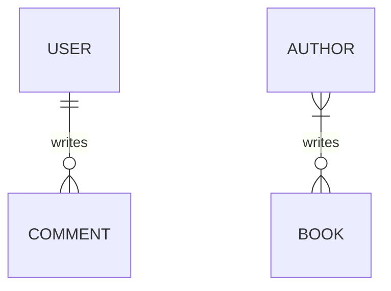

### Constraints

Like data type, constraints provide extra information to the database to help it
manage our data better.

First is the `NOT NULL` constraint. In SQL, by default your column can contain a
special value called `NULL` to represent missing value. If your exam `score` is
`0`, you have an exam, but if your exam score is `null`, it means you don't have
an exam, or in other words: the `score` is missing/not present. If you want to
make sure a column always contain value, you can add the `NOT NULL` constraint
and the database will reject updates if the update can make the column `null`.

Next, we have the `UNIQUE` constraint. It ensures each value in this column can
only appear at most once at a time. Let's say you have a phone number associated
to a social network account. The phone number can be unlinked from an account
and being linked to another account. However, it can't link to two accounts at
the same time. You can use `UNIQUE` constraint to ensure this.

Adding multiple constraints is simple, just list them out in any order you like:

```sql
create table t(
  column_a varchar not null unique, -- this is correct
  column_b varchar unique not null -- this is correct too
);
```

For easier reading, you should stick to a specific order though.

`UNIQUE` can be used on multiple columns. In that case it ensures there will be
no two row with matching data on all the columns listed. For example:

```sql
create table t(
  a integer,
  b integer,
  c integer
  unique(a, b)
);
```

You can insert `a = 1 b = 1` only once, trying to add another row with `a = 1`
and `b = 1` will fail, but you can add another row with `a = 1 b = 2`. As long
as not all columns are the same, it won't be blocked.

Sometimes the data type is not descriptive enough for your data. In these cases,
you can use `CHECK` constraint to further refine it. `CHECK` is defined with an
expression, if the result is true then the update is accepted, but if it is
false, it is rejected.

!!! note

    If you think this `CHECK` constraint can be used to check for `NOT NULL`, you
    are correct. The reason we have `NOT NULL` is similar to data type being
    separated from other constraints: the database can make good use of that
    information so they separate that out. This is a common theme in design, we will
    see this a lot in the future.

Example: to ensure `age` is positive we can write this:

```sql
create table t(
  age integer check (age > 0)
);
```

In practice, we rarely use `CHECK` constraint because the application will
validate the data, not the database.

### Primary key and foreign key

They are also constraints, but they are important enough to warrant a separate
section talking about it.

Primary key is a column (or multiple columns) that can be used to uniquely
identify a row. In SQL, we use `PRIMARY KEY` constraint to define this.
`PRIMARY KEY` implies `NOT NULL` and `UNIQUE`.

```sql
create table t1(id integer primary key); 

-- same as above, but other constraints are redundant 
create table t2(id integer primary key not null unique);
```

!!! tip

    **Good key should be immutable (can't be changed).**

Tables can refer to other tables. To represent the relationship between tables,
we repeat the primary key of a table in the other. These repeated columns are
called **foreign key**. By adding `REFERENCES <table>(<primary_key_column>)`,
the database will know this is a foreign key. The database will make sure
foreign key value matches the referenced primary key.

Example:

```sql
create table people(
  id integer primary key,
  name varchar not null 
);
create table driving_licenses(
  id integer primary key,
  person_id integer references people(id)
);
```

In this example, if `person_id` in `driving_licenses` contains the value `5`,
then there must be a row in the table `people` whose `id` is `5`. The database
ensures this.

Changing primary key value is hard because we also need to update foreign key
value, so usually we will create a column whose value is completely unrelated to
our data to use as primary key. This is called **synthetic key**. Using
synthetic key as primary key is extremely common because it makes the code much
easier to write.

If your primary key consists of multiple columns (in this case the key is called
**composite key**), you can write the constraint on a separate line. Because the
`PRIMARY KEY` constraint is not on a single column anymore, you need to make
sure involved columns are `NOT NULL`.

```sql
create table salaries(
  organisation_id integer not null,
  person_id integer not null,
  salary integer not null,
  primary key(organisation_id, person_id) 
);
```

The foreign key in this case will be multiple columns too:

```sql
create table salaries(
  organisation_id integer not null,
  person_id integer not null,
  salary integer not null,
  primary key(organisation_id, person_id) 
);

create table t(
  organisation_id integer not null,
  person_id integer not null,
  some_data varchar,
  foreign key(organisation_id, person_id) references salaries(organisation_id, person_id)
);
```

!!! info

    This shows why synthetic key is better in practice. You don't need to add
    multiple columns to use as foreign key.

## Modeling your data

The most important thing to keep in mind when designing data model is **making
sure data is correct**. Incorrect data is useless.

We will try to **avoid duplication** because when data is duplicated, we may end
up changing one of the record and miss the other, making them inconsistent and
affect data correctness.

To design your database, we start with identifying **entities** (things) and
their **relationships** from our requirements. Entities group related
**attributes** together.

To identify entities and their attributes, we look for nouns in the requirement.
Let's consider this requirement:

> I want to create a database to track my **reading progress**. I read
> **books**, several **kinds of books**. I want to know how many **pages** I
> read on each **day**. For **completed books**, I want to store a **review** so
> I can revisit later to know what it is about without having to read the whole
> book again.

With the nouns highlighted, we now consider if it should be entity or attribute.
If it is a simple piece of information, it is probably an attribute. However, if
it consists of many pieces, it should be an entity. Below is my analysis:

- Reading progress: current page / total pages
- Book: title, author, publication year

Whether a piece of data is entity or attribute depends mostly on our point of
view. For example: an address can be an entity if we care about its structure,
or if we only store it for display, it can be attribute of another entity.

These information can be captured into a kind of diagram called
**Entity-Relationship Diagram (ERD)**.

!!! warning

    ERD is hard to read, so it is mostly useless in practice. Draw anything you want
    to as long as you can express your entities and relationships.

Relationship is about the number of related records. We only care about zero,
one, or many. Some example of relationships:

- A user can write many comments, but a comment is written by only one user.
    This user-comment relationship is **one-to-many**.
- Reversing the direction, we will get **many-to-one**: A comment can be written
    by a user, but a user can write many comments. This comment-user
    relationship is **many-to-one**.
- Author can write multiple books. A book can be written by multiple authors.
    This relationship is a **many-to-many** relationship.

In diagrams, people usually write `0..1` to express that a side of relationship
allows zero, `0..n` or `*` to signal that the annotated side allows zero. The
example above can be drawn as diagram like this (not ERD):


This reads as:

- A user writes 0 or many comments.
- A comment is written by 1 user.
- An author writes 0 or many books.
- A book is written by 1 or many authors.

The ERD equivalent is:



You can see that ERD is full of strange symbols, it is not clearer. This is why
I said it is mostly useless in practice.

## Modeling example

## Database modeling patterns

### Soft delete

Sometimes we want to keep the data in the database when users request for
deletion. This can be implemented using an extra column to track soft-deleted
timestamp, like this:

```sql
create table t(
    id integer primary key,
    data varchar,
    deleted_at timestamptz
```

### Polymorphic association

When a relationship can refer to different tables, we can add another column to
tell what table are being referenced.

This bypasses the foreign key feature of the database, so we should avoid this
if possible.

<!-- versioned, bitemporal, multi-tenant, lookup table -->

### Creating tables

To create a new table using SQL, you use the `CREATE TABLE` statement:

```sql
create table <your table name here>(
  <your column definitions go here>
);
```

!!! info

    In PostgreSQL, you can use anything as table name, including normal English like
    `"Points of Interest"`. The `snake_case` convention is not a PostgreSQL
    limitation, it is the limitation of the ecosystem around it.

    This is also an example of PostgreSQL feature richness.

A table must have columns. The simplest form of column definition is
`<column name> <data type>`. To define columns we need to learn about another
thing: data type.

### Data types

In SQL, columns have types to let the database system know what can be done on
these values. Different types have different operations available. For example:
adding two numbers together is reasonable, but it doesn't make sense adding
today and yesterday.

There are many similar types in PostgreSQL with different sizes to serve
engineering need. We will ignore most them and only choose one representative
type for each category:

- `boolean`: `true` or `false`
- `integer`: whole numbers (`-1`, `0`, `1`, `999999`, etc.)
- `numeric`: decimal number, e.g: `0.1`, `-12.34`, `987654321.0123456`, etc.
- `varchar` (short for `varying character`): arbitrary text (called "string" in
    programming), wrapped inside single quote. Example: `'this is a string'`
- `date`: date without time, written in ISO format (`YYYY-mm-dd`) and are
    wrapped inside a pair of single quote. Example: `'2025-01-01'`. This is
    rarely useful though, `timestamptz` is better for most use cases.
- `timestamptz` (short for `timestamp with time zone`): confusingly, this is not
    stored as time with time zone, but as elapsed time since epoch, so if you
    really want to preserve the input, you need another column to store the time
    zone. It is wrapped in double quote. Example: `2020-01-01T00:00:01+07:00`

!!! info

    Epoch is a reference point, i.e: a special moment in the timeline being chosen
    to use as the origin to calculate the rest. Any other moment can be represented
    as time elapsed since epoch. For example, if you chose `2000-01-01 00:00:00` as
    epoch, then the timestamp `2000-01-01 00:01:00` is "60 seconds since epoch" and
    the computer just need to store the number `60`. The epoch used by computer
    systems is called Unix epoch, which begins at 1970-01-01 00:00:00 UTC.

There is another number type called `float`. It is *inexact* real numbers.
Ideally we should never need to use it, prefer `numeric` instead.

Note that the number `123` can be stored as `integer` or as `varchar`, but if it
is stored as `varchar`, the system won't know that it is a number and will
prevent you from adding it to another number. Therefore, getting the type
correct is important.

This is the bare minimum that we need to create a column.

Now, we can create a table with columns. Let's take the address example at the
beginning as the modeling target. To create a table to store that, we will use
this SQL query:

```sql
create table addresses(
  building_number varchar,
  street varchar,
  ward varchar,
  city varchar,
  country varchar
);
```

!!! note

    Notice the `building_number` column above? Although the name contains the word
    "number", it is typed as `varchar`. This is to support buildings in alleys which
    contains the forward slash `/`. The colunmn name is not correctly express our
    usage intention. We will see this imperfection in practice a lot. Next time you
    read a schema, make sure to verify the intended use case of them, don't just
    guess from the name.

### Constraints

Apart from data type, relational databases also have other constraints to allow
you to describe your data better. They are called constraints. In a sense, data
type is also a constraint: it restricts what kind of value we can put into a
column. However, it is too important because every operation require it, so the
data type concept is separated from the constraints. Other constraints mentioned
in this section are optional.

First is the `NOT NULL` constraint. In SQL, by default your column can contain a
special value called `NULL` to represent missing value. If your exam `score` is
`0`, you have an exam, but if your exam score is `null`, it means you don't have
an exam, or in other words: the `score` is missing/not present. If you want to
make sure a column always contain value, you can add the `NOT NULL` constraint
and the database will reject updates if the update can make the column `null`.

Constraints are added after data type, like this:

```sql
create table t(
  name varchar not null
);
```

Next, we have the `UNIQUE` constraint. It ensures each value in this column can
only appear at most once at a time. Let's say you have a phone number associated
to a social network account. The phone number can be unlinked from an account
and being linked to another account. However, it can't link to two accounts at
the same time. You can use `UNIQUE` constraint to ensure this.

Adding multiple constraints is simple, just list them out in any order you like:

```sql
create table t(
  column_a varchar not null unique, -- this is correct
  column_b varchar unique not null -- this is correct too
);
```

For easier reading, you should stick to a specific order though.

Sometimes the data type is not descriptive enough for your data. In these cases,
you can use `CHECK` constraint to further refine it. `CHECK` is defined with an
expression, if the result is true then the update is accepted, but if it is
false, it is rejected.

!!! note

    If you think this `CHECK` constraint can be used to check for `NOT NULL`, you
    are correct. The reason we have `NOT NULL` is similar to data type being
    separated from other constraints: the database can make good use of that
    information so they separate that out. This is a common theme in design, we will
    see this a lot in the future.

#### Recap

- `NOT NULL` to ensure the column always contain value
- `UNIQUE` to ensure each value of the column appear at most once at a time
- `CHECK(<condition>)` to add custom validation to the column value

### Key

You may notice that in all the examples about types of database system, a word
is constantly repeated: key. This is also another constraint but it is important
so there is a separate section to talk about it.

A **key** is an **always-present** field that can be used to **uniquely**
identify a record (or in other words, it's `UNIQUE` and `NOT NULL` constraints
combined). It can be chosen from the data, in which case it is called **natural
key** because the key is also part of the data. Or you can make one up, in this
case it is called **synthetic key** because you conjured it out of nowhere and
its value has no relationship with your data.

The naming is a mess, natural key is also called **business key** or **domain
key**, synthetic key is also called **surrogate key** or **artifical key**.
Don't bother remembering these names, just understand the concept and forget
them all.

Sometimes your data can have many fields usable as key. These fields are called
**candidate keys** (forget this too, this concept is not that useful) because
they can be used as key. However, you only choose one of them to use as key. The
one you chose as the key will be called **primary key** in SQL.

!!! tip

    **Good key should be immutable (can't be changed).**

In general, if something is data, it can change, but the key is used to uniquely
identify records, so changing it requires lots of effort. Real world data is
messy, and we are just predicting when we design the data schema, so natural key
tend to turn into maintenance nightmare.

!!! warning

    Never use natural key as primary key if there is a slightest chance of the need
    to update its value, you will regret doing that.

In SQL, to tell the system that a column is primary key, you add `PRIMARY KEY`
to the constraint list. Column marked as `PRIMARY KEY` will be `NOT NULL` and
`UNIQUE` already, so you don't need to add these two constraints.

```sql
create table t1(id integer primary key); 

-- same as above, but other constraints are redundant 
create table t2(id integer primary key not null unique);
```

Note that whether a key is synthetic or natural is relative to its entity. For
example: in the government database, you are stored with a synthetic key: your
citizen ID. However, that same citizen ID can be natural key in another entity
because it is part of a person profile and are guaranteed to be unique enough.

When we have multiple tables, these tables may be related to others. For
example: you as a `person` have a `medical record`, a `driving license`. To
express these relationship, we have **foreign key**. Let's say we have these
tables:

```sql
create table people(
  id integer primary key,
  name varchar not null
);
create table medical_records(
  id integer primary key
);
create table driving_licenses(
  id integer primary key
);
```

How do we express that a medical record/license belongs to a person? We repeat
the primary key of `people` table in these tables:

```sql
create table people(
  id integer primary key,
  name varchar not null
);
create table medical_records(
  id integer primary key,
  person_id integer
);
create table driving_licenses(
  id integer primary key,
  person_id integer
);
```

With this definition, we can add a license for the person with id `123` even if
no such person exists. By defining the new column as foreign key, the database
will check it for you and reject the update if no such person exists. The syntax
is quite long as it need to specify the record being referenced:

```sql
create table people(
  id integer primary key,
  name varchar not null 
);
create table medical_records(
  id integer primary key,
  person_id integer references people(id)
);
create table driving_licenses(
  id integer primary key,
  person_id integer references people(id)
);
```

By adding that `REFERENCES <table>(<primary_key_column>)` clause, the database
will know this is a foreign key.

This check is not free, every update will trigger a foreign key check to ensure
the referenced record actually exist, so sometimes developers are tempted to
avoid defining this constraint. However, the presence of foreign key ensures
data correctness and its benefit is well worth the cost.

!!! tip

    Never skip a foreign key definition for performance reason. Correct data and a
    bit slower processing is better than wrong data and fast processing.

If your primary key consists of multiple columns (in this case the key is called
**composite key**), you can write the constraint on a separate line. Because the
`PRIMARY KEY` constraint is not on a single column anymore, you need to make
sure involved columns are `NOT NULL`.

```sql
create table salaries(
  organisation_id integer not null,
  person_id integer not null,
  salary integer not null,
  primary key(organisation_id, person_id) 
);
```

`UNIQUE` on multiple columns can be defined in the same way, e.g:
`UNIQUE(organisation_id, person_id)`. Similarly, foreign key can be defined as
below:

```sql
create table salaries(
  organisation_id integer not null,
  person_id integer not null,
  salary integer not null,
  primary key(organisation_id, person_id) 
);

-- I'm too lazy to make up another example, don't worry about the table name, doesn't matter
create table t(
  id integer primary key,
  organisation_id integer not null,
  person_id integer not null,
  foreign key(organisation_id, person_id) references salaries(organisation_id, person_id)
);
```

!!! info

    This is an example of why synthetic key is better in practice. You don't need to
    add multiple columns to use as foreign key.

## Modeling your data

First of all, keep this in mind: The essence of data modeling is to ensure
**correctness**. Everything you do must support this. Wrong data is useless.

There are many ways to model the data. What we do is find the model most
suitable for our use cases. There is no such thing as universal solution.

Now let's go through a specific example and see what problems arise as well as
how to resolve them. The simplest way (but inefficient) way to model your data
is putting everything inside a single table. If you want to track customer
purchases of your products, you can have something like this:

| customer_id | customer_name | product_id | product_name | price | price_currency | amount | purchase_date | delivery_status |
| ----------- | ------------- | ---------- | ------------ | ----- | -------------- | ------ | ------------- | --------------- |
| 1           | Customer A    | 1          | Product A    | 500   | VND            | 1      | 2026-03-10    | Delivered       |
| 1           | Customer A    | 2          | Product B    | 10    | VND            | 1      | 2026-03-11    | Delivering      |
| 2           | Customer B    | 2          | Product B    | 10    | VND            | 1      | 2026-03-10    | Packaging       |
| 2           | Customer B    | 3          | Product C    | 10    | USD            | 1      | 2026-03-13    | Delivered       |

Here we are tracking what customer bought what product on what date, and if the
purchase is finished. Try adding a new record, you would easily see that you
don't know what product are available, what customers we are having, and it's
tedious repeating their name in a new row so you can easily end up with entering
incorrect data like `customer_id = 1` but `customer_name = 'Customer B'`. This
is bad design.

!!! danger

    Issues in the table design above:

    - Duplicated data
    - Cannot store products if no one bought it. Similarly, cannot store customers
        before they make their first purchase.
    - Easy to add inconsistent data (for example: mismatch between id and name)

To make sure our design is easy to work with, we can transform our design to
**normalization forms**.

### Normalization forms

There are several normalization forms, we don't need to conform to all of them.
However, the first 3 forms is usually a must:

#### First normalization form (1NF)

**Each cell contains an atomic value.**

**Atomic** means "cannot be further divided". If you can represent your data in
SQL tables, it is highly likely that you have already conformed to 1NF. A
violation is still possible though, here is an example:

| user_id | phone_number          |
| ------- | --------------------- |
| 1       | 0123000111,0123000222 |

This table contains two phone numbers in the same cell. It violates 1NF. To fix
it, you can break it down into multiple rows, one per phone number:

| user_id | phone_number |
| ------- | ------------ |
| 1       | 0123000111   |
| 1       | 0123000222   |

!!! info

    If you still remember the document database mentioned before, you should now see
    why they are called NoSQL: they intentionally break the normalization forms of
    relational databases. A value in the document can be another object, it is not
    an atomic value.

#### Second normalization form (2NF)

- A table needs to be in 1NF, and
- **Value of columns not in primary key require the whole primary key to know**

This form is about splitting unrelated things out. Given the primary key, you
can know what value is stored in any column, but what if we only have a part of
the primary key and we can still know what value is stored in a column? See this
example:

```sql
create table purchases(
  customer_id integer,
  customer_name varchar,
  product_id integer,
  product_name varchar,
  price integer,
  price_currency varchar,
  amount integer,
  purchase_date date,
  delivery_status varchar,
  primary key(customer_id, product_id, purchase_date)
);
```

| customer_id | customer_name | product_id | product_name | price | price_currency | amount | purchase_date | delivery_status |
| ----------- | ------------- | ---------- | ------------ | ----- | -------------- | ------ | ------------- | --------------- |
| 1           | Customer A    | 1          | Product A    | 500   | VND            | 1      | 2026-03-10    | Delivered       |
| 1           | Customer A    | 2          | Product B    | 10    | VND            | 1      | 2026-03-11    | Delivering      |
| 2           | Customer B    | 2          | Product B    | 10    | VND            | 1      | 2026-03-10    | Packaging       |
| 2           | Customer B    | 3          | Product C    | 10    | USD            | 1      | 2026-03-13    | Delivered       |

In this example, if you have the same `customer_id`, you can know the value of
`customer_name`. You don't need the whole primary key (`customer_id`,
`product_id`, and `purchase_date` combined) for that, only a part of it
(`customer_id`) is enough. Similarly for `product_name` and `price`. 2NF
requires you to split them out.

Intuitively, data about the product has nothing to do with data about the
customer, so it's reasonable keeping them in separate tables. The 2NF is there
there to nudge the database designer to respect that intuition.

```sql
create table customers(
  id integer primary key,
  name varchar,
);

create table products(
  id integer primary key,
  name varchar,
  price integer,
  price_currency varchar
);

create table purchases(
  customer_id integer not null references customers(id),
  product_id integer not null references products(id),
  amount integer,
  purchase_date date,
  delivery_status varchar,
  primary key(customer_id, product_id, purchase_date)
);
```

| customer_id | customer_name |
| ----------- | ------------- |
| 1           | Customer A    |
| 2           | Customer B    |

| product_id | product_name | price | price_currency |
| ---------- | ------------ | ----- | -------------- |
| 1          | Product A    | 500   | VND            |
| 2          | Product B    | 10    | VND            |
| 3          | Product C    | 10    | USD            |

| customer_id | product_id | amount | purchase_date | delivery_status |
| ----------- | ---------- | ------ | ------------- | --------------- |
| 1           | 1          | 1      | 2026-03-10    | Delivered       |
| 1           | 2          | 1      | 2026-03-11    | Delivering      |
| 2           | 2          | 1      | 2026-03-10    | Packaging       |
| 2           | 3          | 1      | 2026-03-13    | Delivered       |

Look at the new design, now you can have customers without any purchases, you
can store new products that no one has ever purchased yet, and the purchases are
now much easier to read. Every column now focuses on describing the purchase,
not on something else.

#### Third normalization form (3NF)

2NF is good, but it can be better. 3NF is 2NF but stricter: the columns must
**directly** depend on the primary key.

Let's consider this example:

| employee_id | employee_name | department_id | department_name |
| ----------- | ------------- | ------------- | --------------- |
| 1           | Ema           | 1             | Engineering     |
| 2           | Brett         | 1             | Engineering     |

`employee_id` is the primary key. Given an `employee_id`, we can know what
department they are in. This satisfies 2NF, but we still see duplication here.
The reason is `department_name` can be found using `department_id`, and
`department_id` of an employee can be found using `employee_id`. That's an
indirection. 3NF requires us to split this out so every column can only be found
with just one step from the primary key.

| employee_id | employee_name | department_id |
| ----------- | ------------- | ------------- |
| 1           | Ema           | 1             |
| 2           | Brett         | 1             |

| department_id | department_name |
| ------------- | --------------- |
| 1             | Engineering     |

If you reach 3NF, your design should be ready good enough for production. There
are more advanced normalization forms like BCNF, 4NF, 5NF, 6NF, but they are too
complex for little gain, so only read about them if you are really interested.

## TODO

- Relationships: has many, belongs to, etc.
- Patterns: soft delete, versioned, bitemporal, star schema, audit log,
    polymorphic, multi-tenant, lookup table
- Index explained and id vs uuid
- Advanced types: array, JSON
- Skipped topics: ACID (for developers), isolation level, OLAP DB design (star,
    snowflake), enum (never use this)
