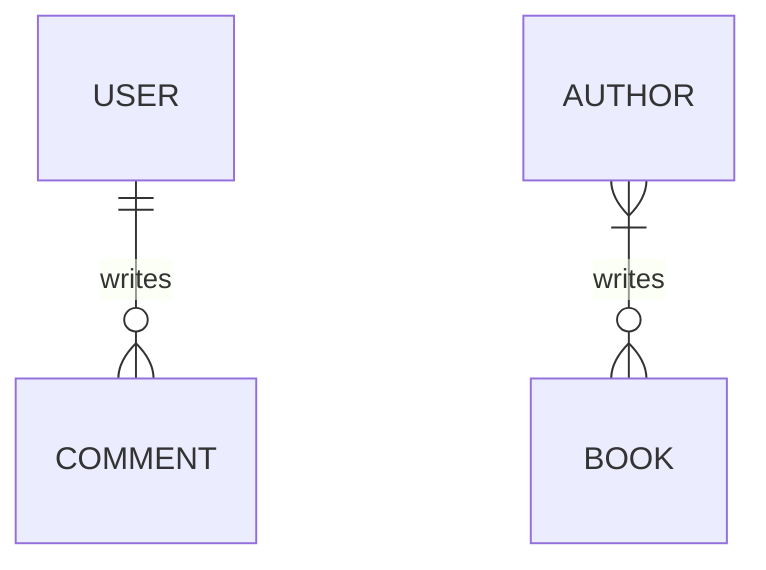

## Modeling your data

To design your database, we start with identifying **entities** (things) and
their **relationships** from our requirements. Entities group related
**attributes** together.

To identify entities and their attributes, we look for nouns in the requirement.
Let's consider this requirement:

> I want to create a database to track my **reading progress**. I read
> **books**, several **kinds of books**. I want to know how many **pages** I
> read on each **day**. For **completed books**, I want to store a **review** so
> I can revisit later to know what it is about without having to read the whole
> book again.

With the nouns highlighted, we now consider if it should be entity or attribute.
If it is a simple piece of information, it is probably an attribute. However, if
it consists of many pieces, it should be an entity. Below is my analysis:

- Reading progress: current page / total pages
- Book: title, author, publication year

Whether a piece of data is entity or attribute depends mostly on our point of
view. For example: an address can be an entity if we care about its structure,
or if we only store it for display, it can be attribute of another entity.

These information can be captured into a kind of diagram called
**Entity-Relationship Diagram (ERD)**.

!!! warning

    ERD is hard to read, so it is mostly useless in practice. Draw anything you want
    to as long as you can express your entities and relationships.

Relationship is about the number of related records. We only care about zero,
one, or many. Some example of relationships:

- A user can write many comments, but a comment is written by only one user.
    This user-comment relationship is **one-to-many**.
- Reversing the direction, we will get **many-to-one**: A comment can be written
    by a user, but a user can write many comments. This comment-user
    relationship is **many-to-one**.
- Author can write multiple books. A book can be written by multiple authors.
    This relationship is a **many-to-many** relationship.

In diagrams, people usually write `0..1` to express that a side of relationship
allows zero, `0..n` or `*` to signal that the annotated side allows zero. The
example above can be drawn as diagram like this (not ERD):


This reads as:

- A user writes 0 or many comments.
- A comment is written by 1 user.
- An author writes 0 or many books.
- A book is written by 1 or many authors.

The ERD equivalent is:



You can see that ERD is full of strange symbols, it is not clearer. This is why
I said it is mostly useless in practice.

## Database modeling patterns

### Soft delete

Sometimes we want to keep the data in the database when users request for
deletion. This can be implemented using an extra column to track soft-deleted
timestamp, like this:

```sql
create table t(
    id integer primary key,
    data varchar,
    deleted_at timestamptz
```

### Polymorphic association

When a relationship can refer to different tables, we can add another column to
tell what table are being referenced.

This bypasses the foreign key feature of the database, so we should avoid this
if possible.

- Patterns: versioned, bitemporal, audit log, multi-tenant, lookup table
- Advanced types: array, JSON
