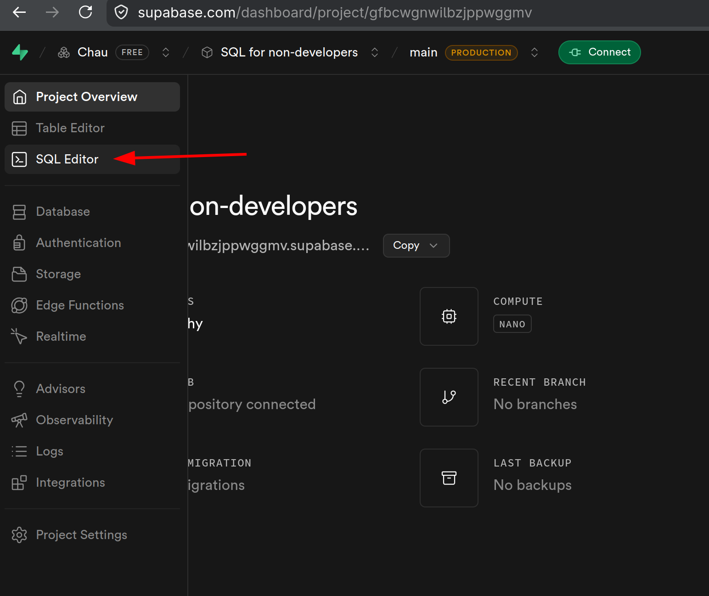

# Getting started

## Structured data

Everything you know can be data, but some are easier to work with. Consider this
address:

```plain
285 Cach Mang Thang Tam Street, Hoa Hung Ward, Ho Chi Minh City, Viet Nam
```

and this:

| Building number | Street              | Ward     | City             | Country  |
| --------------- | ------------------- | -------- | ---------------- | -------- |
| 285             | Cach Mang Thang Tam | Hoa Hung | Ho Chi Minh City | Viet Nam |

They all convey the same information, but the latter makes it trivial to see the
structure of the address while the former doesn't. The plain text address is
called **unstructured data**, while the latter is called **structured data**.

!!! note

    Text is not the only form of unstructured data. Images, audios and videos are
    also unstructured, and they are much harder to work with.

!!! note

    Unstructured data does not mean it has no structure, it means there is no
    obvious structure, you need to derive the structure by reading the data first.
    With structured data, you know exactly what can be there even before reading the
    data. For example, I can just read the header row and know what address parts
    are available.

The structure part is called **data schema**. The schema makes your data
structured by *restricting* what is accepted.

Schemas can be represented by plain English, Example: "an address contains a
building number, street, ward, city and country". This sentence is a schema
written in English. However, we use computer to process data, so the schema is
usually written down in a way the computer can understand, using computer
languages to describe the schema (for example: SQL).

!!! question

    Is it structured or unstructured?

    - A song recording
    - A music score
    - A calendar
    - A hiring post on LinkedIn
    - A hiring post created using a template

??? Answer

    - A song recording: unstructured
    - A music score: structured
    - A calendar: structured
    - A hiring post on LinkedIn: unstructured. While it can be expected to contain
        common elements like job description, benefits, qualifications, it is not
        guaranteed to be true for all hiring posts, so we still consider it
        unstructured.
    - A hiring post created using a template: This is structured, because *all*
        hiring posts created with this template will share the same structure. In
        general, if you can describe *all* records using the same description
        (schema), it is structured

## Interlude: Converting unstructured data to structured data

We can make the data structured by defining appropriate schema and breaking the
unstructured data into parts following the schema designed. Because the
unstructured data can be anything, this process is not guaranteed to be 100%
correct and can be lossy (lose details after conversion). Traditionally we need
to look at the data we have and infer the rules to extract the structured parts
out. Today AI can help with this, but usually human intervention is required if
high-quality data is desired.

Reliably converting unstructured data into structured data is extremely hard and
is not the focus of this article. Here we will work with structured data only.

!!! tip

    Because of that complexity, we should aim at making the data structured in the
    first place if possible. For example, if you want to ask the user a yes/no
    question, you should use a two-choice form field (for example: radio button or a
    checkbox) instead of a free text field. The user can't enter other value using
    the radio button or checkbox, but they can type in some gibberish like "dunno"
    when we expect only "yes" and "no". If you have ever created a form (using
    Google Form for example), you should find this obvious.

## Relational database

There are many kinds of database systems, but the most prevalent one is called
relational database system.

Relational database organizes data in table form and have some special columns
used as key to express the relationship among things. It structures the data
like this:

- Database contains **tables** (also called **relations**)
- Table has **rows** (or **tuple**, **records**, they are the same in the
    context of relational database) and **columns** (**attributes**)
- Columns are metadata describing the structure, while rows contain data itself

!!! info

    What is metadata? The word "meta" means "beyond" and is usually referring to
    looking at the subject with a higher (usually self-referential) perspective.
    Metadata is data used to describe other data. A movie review is data, the
    information about that review (author, review date, etc.) is the metadata.

    Look at the examples of some other uses of the `meta` prefix:

    - Meta-study is study about how to study
    - Meta-process is the process for building and improving other processes
    - Meta-thinking (or metacognition) is thinking about how we think

A relational database organizes data into **tables**, the schema is represented
as **table columns**, each data record is a **table row**. Because of relational
algebra, sometimes people uses weird terms for these simple things though: a
table is sometimes called a **relation**, a column is called **attribute**, and
a row is called **tuple**.

## SQL

SQL is _the_ language to work with relational databases. It can roughly be
divided into **Data Definition Language (DDL)** for describing the schema (the
metadata) and **Data Manipulation Language (DML)** for working with the data.

SQL is designed to be a standard, so theoretically it should be learn SQL once
use it everywhere. However, in reality each relational database system (like
MySQL and Microsoft SQL Server) do things their way without much respect for the
SQL standard, so our SQL knowledge is only partially transferable. Here we will
only learn about PostgreSQL because

- It is free and the community is huge
- It is the most popular database system being used in production
- It is the most SQL standard-compliant database system

## Your first SQL query

To avoid complex setup, we won't install PostgreSQL on our machine, we will use
[Supabase](https://supabase.com) instead. Register an account and create a new
Project. After that, click **SQL Editor** on the left sidebar menu to see the
editor. We will write our SQL queries, run them and see the result here.



To run your query, click **Run** button, or press Ctrl+Enter.

Let's try out our first SQL query.

```sql
SELECT 1;
```

!!! warning

    Note the semicolon at the end. An SQL query ends with a semicolon. Without that
    the database will think your query is incomplete and won't run.

This is the most basic SQL query. An SQL query starts with the action you want
to do. `SELECT` is the query for reading and calculating values. Usually we will
read values from tables, but it is not required. Here we are using `SELECT` as a
calculator.

If you look careful at the output, you should see the column name is `?column?`.
This is because we are calculating an expression so the database does not know
what name to call the result. To give it a name, add it immediately after the
value:

```sql
SELECT 1 any_name_you_like;
```

!!! info

    SQL is case-insensitive, so `SELECT 1 SOME_NAME`, `Select 1 some_NAME` or
    `sElEct 1 sOmE_NaME` are considered the same. Traditionally, people write
    keywords like `SELECT` in all caps, but writing in lowercase is completely fine.
    Just choose what you find easier to read and stick with it, it's fine as long as
    you use a consistent writing style.

PostgreSQL will automatically converts all your names to lowercase. To avoid
confusion, we should use `snake_case` name, i.e: all characters are lowercase,
words are separated using underscore (`_`) instead of whitespaces.

!!! question

    Write these names in `snake_case` form:

    - Point of interest
    - PDF resume
    - Value-added tax
    - Case-insensitive
    - Non-fiction book

??? answer

    - `point_of_interest`
    - `pdf_resume`
    - `value_added_tax`: the hyphen is separating two meaningful words, so we
        replace it with underscore
    - `nonfiction_book`: `non-` is a prefix, not a complete word, so we don't
        separate it with underscore

Sometimes you will see an `AS` before the name (e.g: `SELECT 1+2 AS sum`). The
`AS` keyword is in SQL standard, but it is optional and some old systems don't
support it, so in practice people may avoid writing it out.

The `SELECT` query can retrieve multiple values at the same time, we just need
to separate them with a comma and name them appropriately like this:

```sql
SELECT 1 + 2 AS a, 4 b;
```

In SQL, you can put human-readable explanation into your query using
**comments**, the database will ignore comments when running the query. A
comment is a line starting with `--`. Example:

```sql
-- This is a comment
SELECT
    -- This is another comment
    1 + 2;
```

Newline is also optional in SQL, you can use a space, or a newline, they are
considered the same by the database and won't affect the meaning of your query.
The database does not care about comments and whitespaces. This is what it sees:

```sql
SELECT 1 + 2;
```

Exercise: More expression to test out knowledge about less common operators

!!! question

    Write SQL queries to calculate:

    1. The amount of money after half year given the interest rate of 5%/year and
        initial amount of $1000

    2. GPA for this:

        - Course A: 2 credits, grade: 4
        - Course B: 4 credits, grade: 3

??? answer

    > The amount of money after half year given the interest rate of 5%/year and
    > initial amount of $1000

    ```sql
    SELECT 
        -- Original amount
        1000 +
        -- Interest
        1000 * 0.5;
    ```

    > GPA

    ```sql
    SELECT (
        -- Total grade point
        (2 * 4) + (4 * 3) 
    ) / (
        -- Total credits
        2 + 4
    ) AS gpa;
    ```

## Conclusion

We learned how to write and run some simple SQL queries. In the next post, we
will learn about creating tables to describe the structure of the data.
