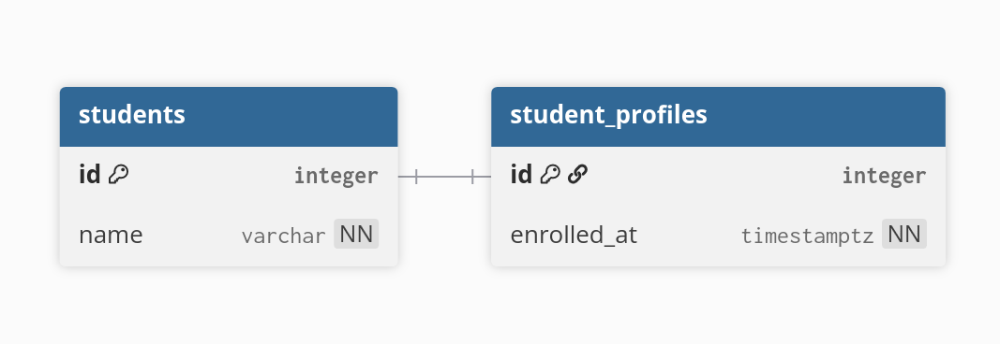
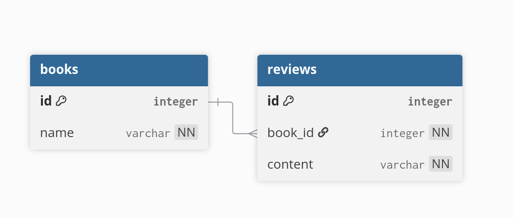
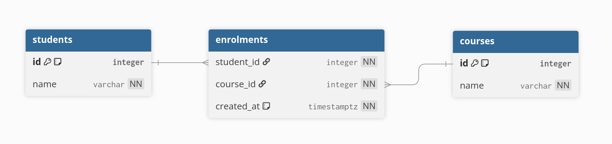

# Relationships and table joining

We learned about foreign key in the previous post, I mentioned that it is used
for setting up **relationships**. In this post, we will learn about the kinds of
relationships and how to make use of them.

## Relationships

When a table refers to or being referred by another table, we say they have a
relationship. Relationships are everywhere. When we buy something, we become the
buyer of that thing, that's a relationship. When we enroll into a course, we are
establishing a relationship with the course.

In SQL, relationships are represented using foreign keys. This ensures you don't
establish relationship between an existing record and a nonexistent one.

```sql
create customers(
    id integer generated always as identity primary key,
    name varchar not null
);

create table purchases(
    id integer generated always as identity primary key,

    -- This establish the relationship
    customer_id integer not null references customers(id)
);
```

In the database world, we care primarily about the cardinality of relationship,
in simpler words: how many records are involved.

When you attend school, you have a single student profile, and this profile is
not reused for any other person. This relationship is called **one-to-one**

You have two hands, they both belong to you -- a single person. This "have
hands" relationship is **one-to-many**.

When a student enrolls into a course:

- A student can enroll into many courses
- A course can have many students

This is **many-to-many** relationship.

## Representing relationships

### One-to-one

This is the simplest one, you choose one table to serve as the owner side, then
make the other table primary key to point to this table.

```sql
create students(
    id integer primary key generated always as identity,
    name varchar not null
);

create student_profiles(
    id integer not null primary key references students(id),
    enrolled_at timestamptz not null
);
```



Note that `student_profiles.id`, it is both a primary key and a foreign key.
Because in one-to-one relationship we only have one on both sides, we don't need
two separate `id`s.

Of course, this is not strictly required, you can still design it like this:

```sql
create students(
    id integer primary key generated always as identity,
    name varchar not null
);

create student_profiles(
    id integer primary key generated always as identity,
    student_id integer not null references students(id),
    enrolled_at timestamptz not null
);
```

Choosing which one to use depends on what your team prefer, there is some
storage overhead for the second approach, but that won't be too much compared to
the time wasted arguing with them about what to use.

### One-to-many

For this, you need to let the many side references the one side.

```sql
create table books(
    id integer primary key generated always as identity,
    name varchar not null
);

create table reviews(
    id integer primary key generated always as identity,
    book_id integer not null references books(id), -- One book has many reviews, so `reviews` contains FK to `books`
    content varchar not null
);
```



### Many-to-many

This relationship is more complex, so we need to use an extra table to express
it:

```sql
create table students(
    id integer primary key generated always as identity,
    name varchar not null
);

create table courses(
    id integer primary key generated always as identity,
    name varchar not null
);

create table enrolments(
    student_id integer not null references students(id),
    course_id integer not null references courses(id),
    created_at timestamptz not null default now()
);
```



## Joining tables

Now that we have the relationship established, let's use the tables created in
**Many-to-many** section. Insert some data first:

```sql
insert into students(name) values 
    ('Alice Smith'),
    ('Bob Jones'),
    ('Charlie Brown'),
    ('Diana Prince');
insert into courses(name) values 
    ('Introduction to Postgres'),
    ('Advanced Database Design'),
    ('Web Development 101');
insert into enrolments (student_id, course_id) values 
    (1, 1), -- Alice in Introduction to Postgres
    (1, 2), -- Alice in Advanced Database Design
    (2, 1), -- Bob in Introduction to Postgres
    (3, 3), -- Charlie in Web Development 101
    (4, 2); -- Diana in Advanced Database Design
```

To connect a row from this table to a row from another table, we use `JOIN`:

```sql
select <...>
from <table1> join <table2> on <join-condition>
```

`JOIN` condition is usually equality check, because that's how we use foreign
key. Let's try this with the database above:

```sql
select *
from students join enrolments on students.id = enrolments.student_id;
```

We get

| id  | name          | student_id | course_id | created_at                    |
| --- | ------------- | ---------- | --------- | ----------------------------- |
| 1   | Alice Smith   | 1          | 1         | 2026-06-12 11:43:05.027216+00 |
| 1   | Alice Smith   | 1          | 2         | 2026-06-12 11:43:05.027216+00 |
| 2   | Bob Jones     | 2          | 1         | 2026-06-12 11:43:05.027216+00 |
| 3   | Charlie Brown | 3          | 3         | 2026-06-12 11:43:05.027216+00 |
| 4   | Diana Prince  | 4          | 2         | 2026-06-12 11:43:05.027216+00 |

Do you see `Alice Smith` being repeated twice here? That's what JOIN does. For
each row from this table, it will try to match with every row from the other
table and keep all rows satisfying the condition.

TODO: Example of small tables joining together here. Step by step explanation

TODO: Write about other JOIN forms
